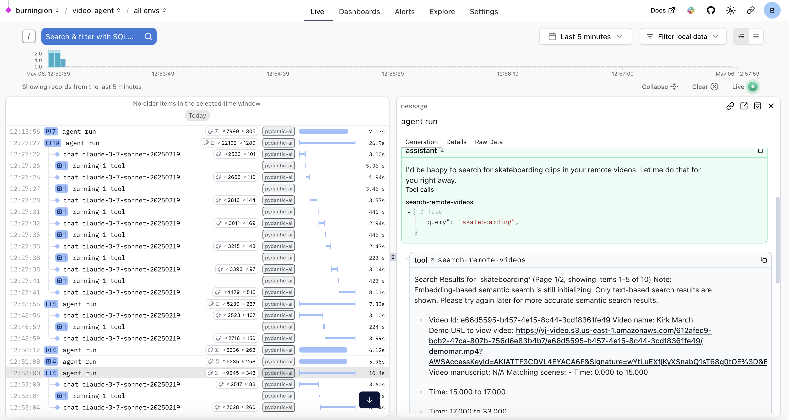

# Pydantic Video Editing Agent 

You'll need a Video Jungle API key and an Anthropic key. Once you've got both:

```
uv run hello.py
```

This will call the MCP server to search your video files for skateboarding.

You can then view the Agent's activities in Logfire:

