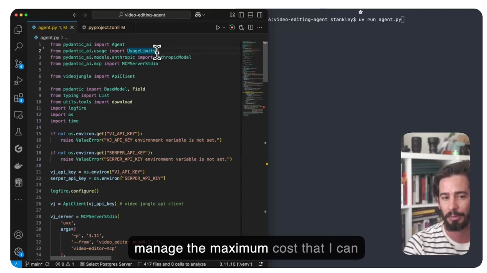
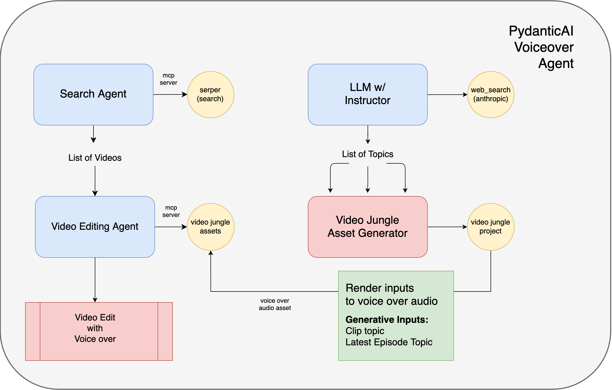
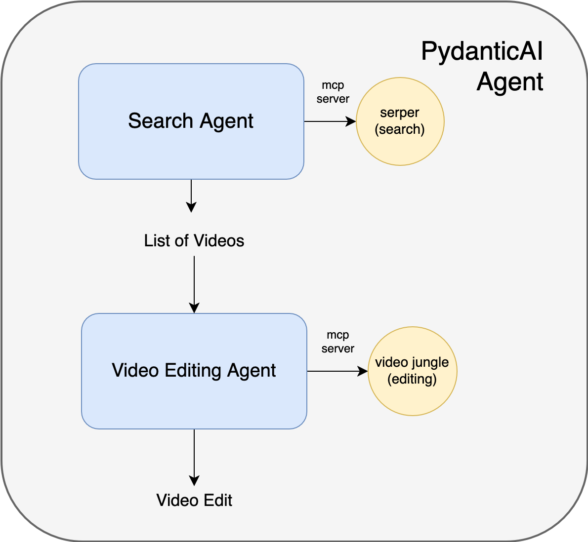

# Pydantic Nathan Fielder Video Editing Agent

Click below to watch the repo in action on YouTube:

[](https://www.youtube.com/watch?v=C-ewKa3NcZI)

You'll need a [Video Jungle API key](https://app.video-jungle.com/profile/settings), set as `VJ_API_KEY`, an Anthropic API key, and a [Serper API Key](https://serper.dev/), set as `SERPER_API_KEY`.

You can then git clone this repo, followed by a `uv sync`.

## Search, Edit, and Generate Voiceover Agent



This agent creates a video edit featuring the latest episode of The Rehearsal as a subject, with found media and a voiceover narration created from online discussions.

It first uses web search with Anthropic's [web search tool](https://docs.anthropic.com/en/docs/agents-and-tools/tool-use/web-search-tool), to find the latest information on Nathan Fielder's [The Rehearsal](https://www.hbo.com/the-rehearsal).

It will use these results to try to come up with 5 ideas for topics to talk about latest episode of the show.

From there, it creates a Video Jungle project with a `prompt-to-speech` asset generator. 

This will create a custom prompt that allows us to pass in our created topics, and come up with a voiceover narration on demand to accompany our videos.

Next, we search the web to find source video clips about the show, download them, and add them to the same project for analysis and retrieval.

From there, we use the [Video Jungle MCP server](https://github.com/burningion/video-editing-mcp) to prompt for for our edit! 

We get back a video edit right in the browser, with our voice over and analysis from the latest episode.

## Search and Edit Video Agent



This Agent project runs on [uv](https://docs.astral.sh/uv/getting-started/installation/) to manage dependencies. (It's great!)

For this Agent, you can then do a:

```
uv sync
uv run agent.py
```

The first command will install dependencies, the second runs the agents.

The first Agent will search for the latest Nathan Fielder videos, download them to your computer, create a new Video Jungle project, and then upload them to Video Jungle for analysis in a new project.

It will then use this analysis and project to create a new video edit for you using a Video Editing Agent.

## Search and Query Video Files Agent 

The other example in this project searches through your Video Files on Video Jungle.

```
uv run search.py
```

This will call the MCP server to search your video files for skateboarding, and generate a text summary of each video. 

# Example output

Here's an example output from my collection:

```
# Skateboarding Videos Summary

I've found a total of 7 skateboarding videos in your remote collection. Here's a summary of each:

## 1. Kirk March Demo
**Video ID**: e66d5595-b457-4e15-8c44-3cdf8361fe49
- **Description**: This appears to be a demo/tutorial video of the Videojungle platform showing its features, including automated video creation capabilities. It includes a skateboarding compilation demonstration as one of the examples.
- **Notable**: Contains multiple skateboarding scenes scattered throughout the video, particularly toward the end.

## 2. Andy's line at Tampa Pro
**Video ID**: 36b3b3e3-1e02-43e9-89bc-aebbb5325299
- **Description**: Professional skateboarding competition footage from what appears to be the Tampa Pro event. Shows indoor skateboarding with Monster Energy and Independent Truck Company sponsorship.
- **Duration**: Approximately 2.5 minutes
- **Setting**: Indoor skate park with an enthusiastic crowd watching.
- **Content**: Features multiple skaters performing aerial tricks, grinds, and jumps while wearing protective gear.

## 3. Harry Shuman skate part
**Video ID**: b292d015-230a-42a8-bce7-8fdd0838623d
- **Description**: A skateboarding highlight reel featuring Harry Shuman.
- **Duration**: Approximately 3.75 minutes
- **Setting**: Outdoor skate park with palm trees visible, featuring both daytime and nighttime skating.
- **Content**: Various skateboarding tricks and maneuvers performed on ramps, rails, and concrete surfaces.

## 4-6. Louie Barletta Bag of Suck (appears 3 times in results)
**Video ID**: d08c0556-1d1c-49d1-a92b-fca457adc4ba
- **Description**: A classic skateboarding video part from Louie Barletta's "Bag of Suck" with commentary from someone named Dean.
- **Duration**: Approximately 6 minutes
- **Setting**: Various urban settings - streets, skateparks, and architectural features.
- **Content**: Extensive skateboarding sequences showing technical tricks in different locations, interspersed with casual moments and interactions.
- **Production**: Features Thrasher Magazine branding throughout.

## 7. Colin Miller skate part
**Video ID**: 86f37f08-98fa-4bb2-bb75-e164276c1933
- **Description**: Skateboarding footage of Colin Miller showing his progression.
- **Setting**: Outdoor skate park with concrete ramps, metal railings, and a chain-link fence. Located near Fleischmann Community Center and Jenny Moore Park.
- **Content**: Shows both successful tricks and falls, documenting the practice and challenges of skateboarding. Features scenes in both daytime and nighttime settings.

## 8. Louie Barletta Man Down
**Video ID**: f6fd9df7-cf4b-4237-bde3-f09bb5bdc8b1
- **Description**: A skateboarding montage following Jay Head.
- **Setting**: Various locations including skateparks, urban spots, and beach settings.
- **Duration**: Approximately 4 minutes
- **Content**: Combines skateboarding tricks with lifestyle footage, showing both action sequences and casual moments.

These videos represent a mix of professional competition footage, personal skateboarding highlights, and classic skateboarding video parts from well-known skaters. They showcase various styles, locations, and time periods in skateboarding culture.
```

You can then view the Agent's activities in Logfire:


## What's Next

Next I'll show how to incorporate generative video assets in order to create unique edits on demand, from remotely called Agents.